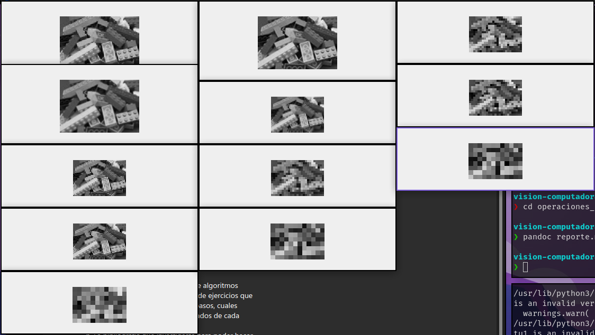
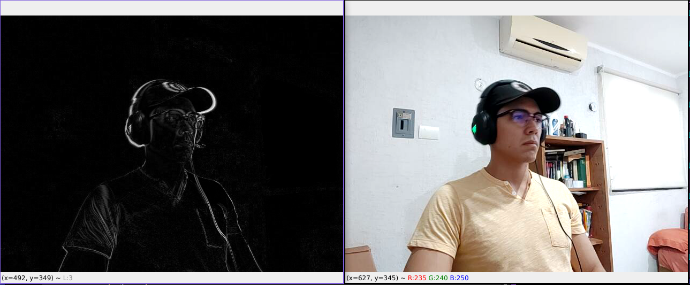
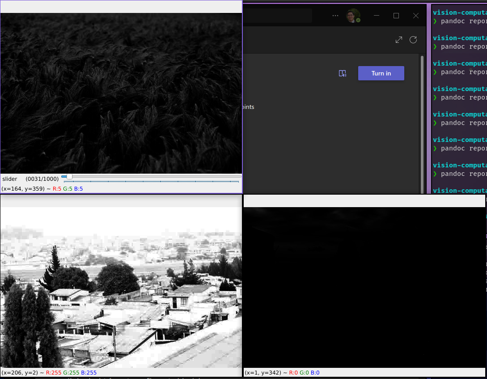
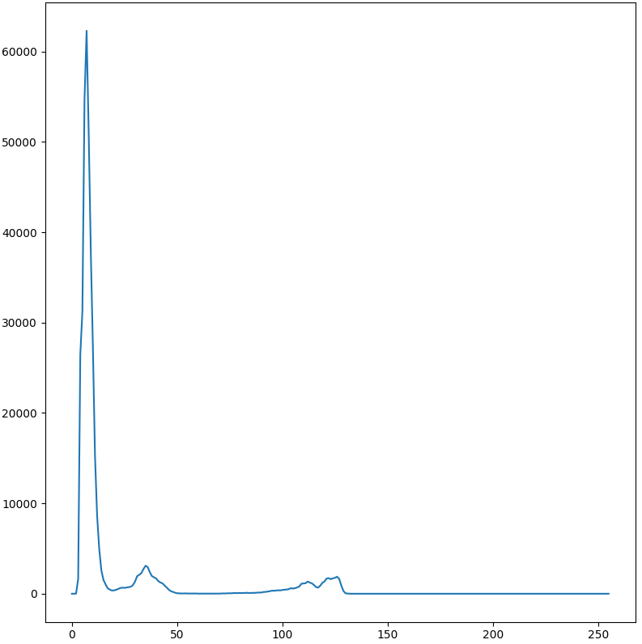
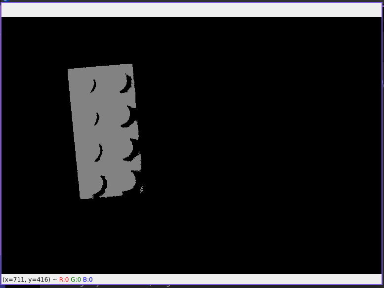

\newpage
# Punto 1

## Resultados

Aquí se pueden observar las 12 posibles combinaciones (4 resoluciones y 3 diferentes métodos de interpolación).
Comparando visualmente los resultados obtenidos, el método de vecino más cercano tiende a dar resultados menos suaves que los otros métodos, ya que el método lineal y cúbico dan resultados más parecidos entre sí. Esto se hace más obvio cuando se aumenta la resolución de la imagen, ya que cuando se disminuye, los resultados no son obvios, debido a los poco pixeles de la imagen.

## Bibliografía

).](reporte-media/cv-resize.png)

## Librerías

- opencv-contrib-python
- numpy

## Algoritmos propios

N/A.

## Problemas

N/A.

\newpage
# Punto 2

## Resultados

Aquí se puede observar del lado izquierdo la diferencia entre el frame actual y el frame pasado del video captado con la cámara de video de mi celular.

## Bibliografía

).](reporte-media/cv-absdiff.png)

## Librerías

- opencv-contrib-python

## Algoritmos propios

N/A.

## Problemas

La cámara de mi computadora no funciona, pero usé la aplicación DroidCam para poder obtener el video de mi celular y usarlo dentro de mi computadora.

\newpage
# Punto 3

## Resultados

Aquí se pueden observar las 3 imágenes y cómo se ven afectadas con el cambio de gamma. El valor nuevo de la gamma se define por medio del slider de la imagen de arriba a la izquierda. A pesar de que visualmente tiene un rango de 0 a 1000, hay una función que normaliza el rango al requerido de 0.01 a 4 para cumplir con los requerimientos.

## Bibliografía

).](reporte-media/cv-lut.png)

).](reporte-media/np-interp.png)

).](reporte-media/cv-createTrackbar.png)

\newpage

## Librerías

- opencv-contrib-python
- numpy

## Algoritmos propios

N/A.

## Problemas

N/A.

\newpage
# Punto 4

## Resultados

Aquí se puede observar el histrograma generado, el cual indica que el valor más brillante de la imagen es entre 100 y 130, lo quiere decir que ese rango de valores es el que se tiene que pasar a la función de binarización para poder separar el objeto más brillante de la imagen. El resultado de esta binarización se puede observar en la siguiente imagen.

\newpage
## Bibliografía

).](reporte-media/cv-calcHist.png)

).](reporte-media/cv-threshold.png)

## Librerías

- opencv-contrib-python
- numpy
- matplotlib

## Algoritmos propios

N/A.

## Problemas

N/A.

\newpage
# Conclusiones

A pesar de que los algoritmos de esta tarea se centran totalmente en el procesamiento de imágenes, son de suma utilidad para poder preparar la información que estas contienen y poder pasar propiamente a algoritmos de visión por computadora y lograr que estos funcionen de manera óptima o, aunque sea, de manera más eficiente. Esto debido a que el pre procesamiento de las imagenes que estos algoritmos van a utilizar logra que funcionen más pegados a su rendimiento teórico, lo que quiere decir que pueden proveer mejores resultados, que, al final de cuentas, es lo que a las personas que los utilizan les interesa.

# Código

[Repositorio de Github.](https://github.com/FelipeSanchezSoberanis/vision-por-computadora/tree/main/operaciones_pixel_a_pixel)

